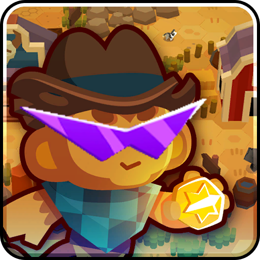

<h1 align="center">

Frontier Remix
<h3 align="center">
Adds some Quality of Life changes to Frontier Legends.
</h3>
</h1>

### Current Features

- Press Space to toggle Freecam Mode in the Frontier Map
  - Click to pan around, Scroll Wheel to zoom in / out
- Use F1-F4 to Fast Forward within the Frontier Map
  - Speeds are 1x, 2x, 3x, 5x
- Auto walk to nearest campfire by clicking the campfire button twice

See the Mod Settings page for customization.

